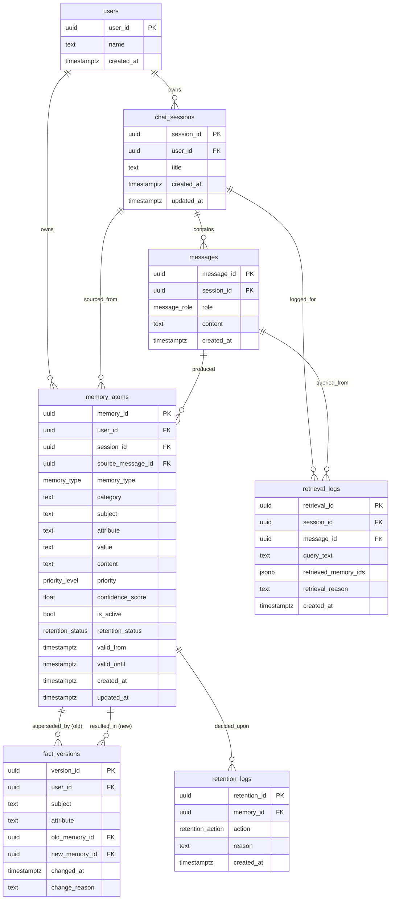

# Database Design — Universal Memory Architecture for LLM Agents

This document describes the full relational schema of the **Memory Architecture**
system proposed in *"A Memory Architecture for LLM with Temporal Fact Tracking and
Selective Retention"*. It is a backend service that stores user facts as
**structured, versioned memory atoms** and exposes them through a REST API to any
LLM agent (e.g. the bundled ChatGPT-style agent).

- Schema DDL: [`db/schema.sql`](../db/schema.sql)
- Backend ORM: [`backend/app/models.py`](../backend/app/models.py)

---

## 1. Overview

The database is a single PostgreSQL database (`memory_db`) containing **7 tables**,
each with one distinct concern in the memory lifecycle:

| # | Table             | Concern                                                        |
|---|-------------------|----------------------------------------------------------------|
| 1 | `users`           | Ownership of memories (client agents / people)                 |
| 2 | `chat_sessions`   | Multi-turn conversations                                       |
| 3 | `messages`        | Raw interaction log (source for extraction)                    |
| 4 | `memory_atoms`    | **Core store** — structured, versioned facts                  |
| 5 | `fact_versions`   | Temporal change history (old → new atom transitions)           |
| 6 | `retrieval_logs`  | Audit of every retrieval event                                 |
| 7 | `retention_logs`  | Audit of every retention decision                              |

Supporting objects: 5 ENUM types, 12+ indexes, 2 triggers, 1 view, 2 extensions.

---

## 2. Entity-Relationship Diagram



---

## 3. ENUM Types

| ENUM               | Allowed values                                     | Used by                 |
|--------------------|----------------------------------------------------|-------------------------|
| `memory_type`      | `FACT`, `PREFERENCE`, `GOAL`, `RULE`, `EVENT`      | `memory_atoms.memory_type` |
| `priority_level`   | `CRITICAL`, `HIGH`, `MEDIUM`, `LOW`                | `memory_atoms.priority` |
| `retention_status` | `ACTIVE`, `ARCHIVED`, `IGNORED`                    | `memory_atoms.retention_status` |
| `message_role`     | `user`, `assistant`                                | `messages.role`         |
| `retention_action` | `KEEP`, `ARCHIVE`, `IGNORE`, `UPDATE`              | `retention_logs.action` |

---

## 4. Table Specifications

### 4.1 `users`

| Field       | Type          | Constraint          | Description        |
|-------------|---------------|---------------------|--------------------|
| `user_id`   | UUID          | PK, default `gen_random_uuid()` | Unique user identifier |
| `name`      | TEXT          | NOT NULL default `''` | Display name      |
| `created_at`| TIMESTAMPTZ   | NOT NULL default `now()` | Account creation time |

### 4.2 `chat_sessions`

| Field        | Type        | Constraint                     | Description            |
|--------------|-------------|--------------------------------|------------------------|
| `session_id` | UUID        | PK                             | Unique session id      |
| `user_id`    | UUID        | FK → `users` ON DELETE CASCADE | Owning user            |
| `title`      | TEXT        | NOT NULL default `'New chat'`  | Session title          |
| `created_at` | TIMESTAMPTZ | NOT NULL default `now()`       | Session start          |
| `updated_at` | TIMESTAMPTZ | NOT NULL default `now()`       | Last activity (trigger)|

### 4.3 `messages`

| Field        | Type        | Constraint                    | Description          |
|--------------|-------------|-------------------------------|----------------------|
| `message_id` | UUID        | PK                            | Unique message id    |
| `session_id` | UUID        | FK → `chat_sessions` ON DELETE CASCADE | Owning session |
| `role`       | `message_role` | NOT NULL                   | `user` / `assistant` |
| `content`    | TEXT        | NOT NULL                      | Full message text    |
| `created_at` | TIMESTAMPTZ | NOT NULL default `now()`      | Message timestamp    |

### 4.4 `memory_atoms` (core)

| Field               | Type             | Constraint            | Description                              |
|---------------------|------------------|-----------------------|------------------------------------------|
| `memory_id`         | UUID             | PK                    | Unique atom id                           |
| `user_id`           | UUID             | FK → `users`          | Owner                                    |
| `session_id`        | UUID             | FK → `chat_sessions` (NULL-able) | Source session                 |
| `source_message_id` | UUID             | FK → `messages` (NULL-able) | Producing message                 |
| `memory_type`       | `memory_type`    | NOT NULL              | FACT / PREFERENCE / GOAL / RULE / EVENT  |
| `category`          | TEXT             | NOT NULL default `'general'` | Subcategory (project, deadline…) |
| `subject`           | TEXT             | NOT NULL              | Entity described (user, project…)        |
| `attribute`         | TEXT             | NOT NULL              | Property stored (deadline, language…)    |
| `value`             | TEXT             | NOT NULL              | Actual memory value                      |
| `content`           | TEXT             | NOT NULL              | Natural-language memory text             |
| `priority`          | `priority_level` | NOT NULL default `'MEDIUM'` | CRITICAL/HIGH/MEDIUM/LOW          |
| `confidence_score`  | DOUBLE PRECISION | CHECK 0.0–1.0, default 0.5 | Extraction confidence              |
| `is_active`         | BOOLEAN          | NOT NULL default `TRUE` | Currently valid?                         |
| `retention_status`  | `retention_status`| NOT NULL default `'ACTIVE'` | ACTIVE/ARCHIVED/IGNORED          |
| `valid_from`        | TIMESTAMPTZ      | NOT NULL default `now()` | When this value became valid          |
| `valid_until`       | TIMESTAMPTZ      | NULL default            | When superseded (NULL = active)          |
| `created_at`        | TIMESTAMPTZ      | NOT NULL default `now()` | Insertion time                        |
| `updated_at`        | TIMESTAMPTZ      | NOT NULL default `now()` | Last modification (trigger)           |

**Integrity rule:** the partial unique index
`uq_memory_active_subject_attribute (user_id, subject, attribute) WHERE is_active = TRUE
AND memory_type IN ('FACT','PREFERENCE','GOAL')`
guarantees **at most one active version per (subject, attribute)** — the database
itself enforces temporal versioning (requirement R.3 / R.4.3).

> **EVENT atoms are exempt** from the uniqueness constraint on purpose: a
> specific one-time event (e.g. *"attended the 2026 AI conference"*) is never
> "updated", it is *accumulated* — the same (subject, attribute) may appear in
> many active rows so no past event is lost or overwritten. EVENT atoms are
> retired by the retention sweep instead.

### 4.5 `fact_versions`

| Field           | Type        | Constraint                      | Description               |
|-----------------|-------------|---------------------------------|---------------------------|
| `version_id`    | UUID        | PK                              | Unique change record      |
| `user_id`       | UUID        | FK → `users` ON DELETE CASCADE  | Owning user               |
| `subject`       | TEXT        | NOT NULL                        | Entity whose fact changed |
| `attribute`     | TEXT        | NOT NULL                        | Attribute that changed    |
| `old_memory_id` | UUID        | FK → `memory_atoms` (NULL-able) | Previously active atom    |
| `new_memory_id` | UUID        | FK → `memory_atoms` (NULL-able) | New active atom           |
| `changed_at`    | TIMESTAMPTZ | NOT NULL default `now()`        | Time of update            |
| `change_reason` | TEXT        | NULL default                    | Optional explanation      |

### 4.6 `retrieval_logs`

| Field                | Type        | Constraint                         | Description          |
|----------------------|-------------|------------------------------------|----------------------|
| `retrieval_id`       | UUID        | PK                                 | Unique retrieval     |
| `session_id`         | UUID        | FK → `chat_sessions` (NULL-able)   | Session              |
| `message_id`         | UUID        | FK → `messages` (NULL-able)        | Query message        |
| `query_text`         | TEXT        | NOT NULL                           | Retrieval query      |
| `retrieved_memory_ids`| JSONB      | NOT NULL default `'[]'`            | Retrieved atom IDs   |
| `retrieval_reason`   | TEXT        | NULL default                       | Selection reason     |
| `created_at`         | TIMESTAMPTZ | NOT NULL default `now()`           | Retrieval timestamp  |

### 4.7 `retention_logs`

| Field         | Type                | Constraint                      | Description          |
|---------------|---------------------|---------------------------------|----------------------|
| `retention_id`| UUID                | PK                              | Unique decision      |
| `memory_id`   | UUID                | FK → `memory_atoms` ON DELETE CASCADE | Affected atom  |
| `action`      | `retention_action`  | NOT NULL                        | KEEP/ARCHIVE/IGNORE/UPDATE |
| `reason`      | TEXT                | NULL default                    | Reason for decision  |
| `created_at`  | TIMESTAMPTZ         | NOT NULL default `now()`        | Decision timestamp   |

---

## 5. Indexes

| Index                                   | Table            | Purpose                                  |
|-----------------------------------------|------------------|------------------------------------------|
| `uq_memory_active_subject_attribute`    | `memory_atoms`   | **Partial unique** — one active version per (subject, attribute) |
| `idx_sessions_user`                     | `chat_sessions`  | Sessions by user                         |
| `idx_sessions_updated`                  | `chat_sessions`  | Recent-session ordering (sidebar)        |
| `idx_messages_session`                  | `messages`       | Ordered message history                  |
| `idx_memory_user` / `_session` / `_source_msg` | `memory_atoms` | FK lookups                          |
| `idx_memory_active`                     | `memory_atoms`   | Partial — fast retrieval filter `is_active AND valid_until IS NULL` |
| `idx_memory_type_prio`                  | `memory_atoms`   | Type/priority filtering + ranking        |
| `idx_memory_subject`                    | `memory_atoms`   | Temporal lookups by (subject, attribute) |
| `idx_memory_content_trgm`               | `memory_atoms`   | GIN trigram — full-text fallback search  |
| `idx_fact_versions_user` / `_subj`      | `fact_versions`  | Version-history queries                  |
| `idx_retrieval_logs_session`            | `retrieval_logs` | Per-session retrieval audit              |
| `idx_retention_logs_memory` / `_created`| `retention_logs` | Retention audit queries                  |

---

## 6. Triggers & Functions

| Trigger                      | Event             | Function             | Effect                                   |
|------------------------------|-------------------|----------------------|------------------------------------------|
| `trg_memory_atoms_updated`   | `UPDATE` on `memory_atoms` | `fn_set_updated_at` | Sets `updated_at = now()` on any UPDATE |
| `trg_sessions_updated`       | `UPDATE` on `chat_sessions` | `fn_set_updated_at` | Touches session `updated_at`           |

Temporal update and retention logic live in the **application service layer**
(`TemporalManager`, `RetentionManager`) so the behavior is auditable and testable;
the partial-unique index above is the DB-level backstop that makes conflicting
versions impossible.

---

## 7. Temporal Versioning (R.3)

For each `(subject, attribute)` the store keeps an ordered history of values:

```
H(s, a) = {(v1, t_start, t_end), (v2, t_start, t_end), ..., (vn, t_start, NULL)}
```

When a new `FACT`/`PREFERENCE` atom arrives for an existing active pair:

| Existing active value | Action                                                              |
|-----------------------|---------------------------------------------------------------------|
| none                  | Insert as new active atom (`valid_until = NULL`)                    |
| same                  | **No duplicate** — refresh `updated_at` (reinforcement)             |
| different             | 1. Close old: `is_active=false`, `valid_until=now()`<br>2. Insert new active atom<br>3. Write `fact_versions` (old_id, new_id, reason) |

Retrieval then filters `is_active = TRUE AND valid_until IS NULL` (view
`active_memory_atoms`).

---

## 8. Selective Retention Policy (R.5)

| Memory type | Default priority | Retention action                                         |
|-------------|------------------|----------------------------------------------------------|
| RULE        | CRITICAL         | Exempt from archiving; kept permanently                  |
| GOAL        | HIGH             | Kept active while the goal is ongoing                    |
| PREFERENCE  | HIGH             | Kept; only latest active version retained                |
| FACT        | HIGH / MEDIUM    | Latest version kept; older versions archived             |
| EVENT       | LOW / MEDIUM     | Archived after configurable threshold period             |

Every decision is written to `retention_logs` for traceability.

---

## 9. Non-functional notes

- **Performance:** target ≤ 5,000 atoms with no measurable retrieval degradation.
  All hot queries are covered by the partial + B-tree indexes above.
- **Extensibility:** new atom types are added by extending the `memory_type` ENUM
  without touching retrieval/retention logic.
- **Modularity:** the relational store is swappable behind the SQLAlchemy layer;
  the vector store (ChromaDB) is swappable behind the `VectorStore` interface.
