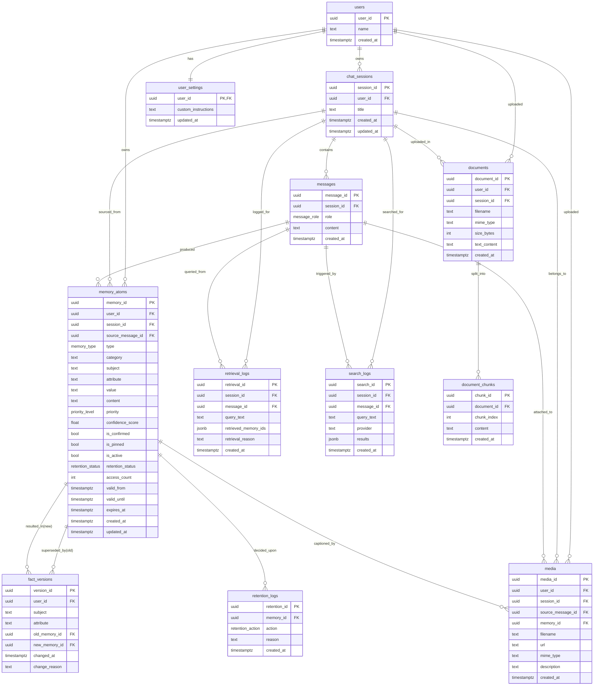

# ERD — Memory Architecture Database

Entity-relationship diagram for the `memory_db` PostgreSQL schema (12 tables).
DDL source: [`db/schema.sql`](../db/schema.sql).

## Relationships

| From | To | Cardinality | FK / On delete |
|---|---|---|---|
| `users` | `chat_sessions` | 1 → N | `user_id` / CASCADE |
| `chat_sessions` | `messages` | 1 → N | `session_id` / CASCADE |
| `users` | `memory_atoms` | 1 → N | `user_id` / CASCADE |
| `chat_sessions` | `memory_atoms` | 1 → N (optional) | `session_id` / SET NULL |
| `messages` | `memory_atoms` | 1 → N (optional) | `source_message_id` / SET NULL |
| `memory_atoms` | `fact_versions` (old) | 1 → N | `old_memory_id` / SET NULL |
| `memory_atoms` | `fact_versions` (new) | 1 → N | `new_memory_id` / SET NULL |
| `chat_sessions` | `retrieval_logs` | 1 → N | `session_id` / CASCADE |
| `messages` | `retrieval_logs` | 1 → N (optional) | `message_id` / SET NULL |
| `memory_atoms` | `retention_logs` | 1 → N | `memory_id` / CASCADE |
| `users` | `media` | 1 → N | `user_id` / CASCADE |
| `chat_sessions` | `media` | 1 → N (optional) | `session_id` / SET NULL |
| `messages` | `media` | 1 → N (optional) | `source_message_id` / SET NULL |
| `memory_atoms` | `media` | 1 → N (optional) | `memory_id` / SET NULL |
| `users` | `user_settings` | 1 → 1 | `user_id` / CASCADE |
| `chat_sessions` | `search_logs` | 1 → N (optional) | `session_id` / CASCADE |
| `messages` | `search_logs` | 1 → N (optional) | `message_id` / SET NULL |
| `users` | `documents` | 1 → N | `user_id` / CASCADE |
| `chat_sessions` | `documents` | 1 → N (optional) | `session_id` / SET NULL |
| `documents` | `document_chunks` | 1 → N | `document_id` / CASCADE |

## Key notes

- `memory_atoms` is the hub: ownership (`users`), provenance (`chat_sessions`,
  `messages`), and references from both audit tables (`fact_versions`,
  `retention_logs`).
- `media` links each uploaded photo to the user, optional session/message, and
  the memory atom whose value is the vision caption (`user/photo` EVENT).
- `fact_versions` has two FKs to `memory_atoms` — a transition record from
  `old_memory_id` to `new_memory_id`.
- `is_pinned` on `memory_atoms` marks user-pinned facts; the retention sweep
  never archives pinned atoms.
- `expires_at` is the user-set expiry ("remember X until <date>" or picked in
  the calendar). Atoms past their expiry are auto-archived at the start of
  every chat turn and during the sweep — unless pinned. Distinct from
  `valid_until`, which records temporal-version closure.
- `documents` + `document_chunks` back document RAG; each chunk is embedded in
  the local vector store under the synthetic id `doc:<chunk_id>` with metadata
  `kind=document`, so document retrieval shares the same hybrid pipeline.
- `search_logs` stores the full JSONB result list of each web search for
  auditing/citation reconstruction.
- Partial unique index `uq_memory_active_subject_attribute` on
  `(user_id, subject, attribute) WHERE is_active AND memory_type IN
  ('FACT','PREFERENCE','GOAL')` enforces at most one active version per fact.
